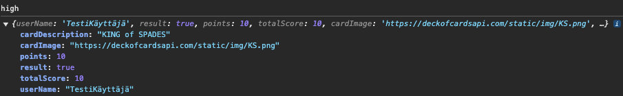
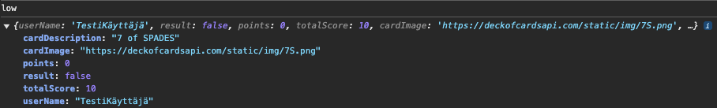
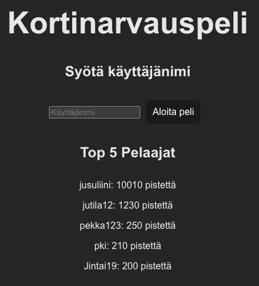
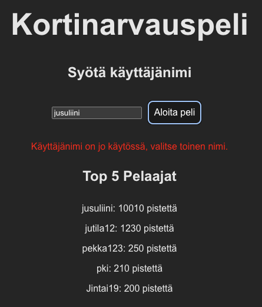
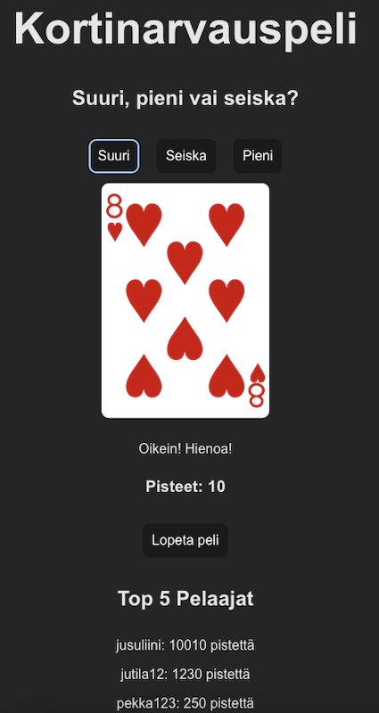

# Sovelluskehitys MERN-stackilla, JavaScript ja MongoDB + Mongoose integrointi

## Tiivistelmä

Tässä projektissa kehitettiin web-pelisovellus MERN-stackin avulla, joka koostuu MongoDB:stä, Expressistä, Reactista ja Node.js:stä. Sovelluksessa käyttäjä rekisteröityy uniikilla käyttäjätunnuksella ja pelaa korttipeliä, jossa arvataan, onko seuraava kortti suuri, pieni vai seitsemän. Pelin lopussa käyttäjän tulos ja pisteet tallennetaan MongoDB-tietokantaan.

Projektin tavoitteena oli erityisesti oppia MongoDB:n ja Mongoose-kirjaston käyttöä JavaScript-ympäristössä. Kehityksessä painopiste oli tietokannan integroimisessa sovelluksen backendiin ja MongoDB:n tehokkaassa hyödyntämisessä käyttäjätietojen ja pelitulosten tallentamisessa.

Tämän lisäksi kehitysprosessin aikana opin myös sessioiden hallinta ja käyttäjätietojen turvallista käsittelyä, kun ne nousivat esiin palautteen ja sovelluksen toiminnallisuuksien kehittämisen myötä. Näiden oppien avulla varmistettiin käyttäjäistuntojen hallinta ja tietojen suojaus, mikä paransi sovelluksen käyttökokemusta ja tietoturvaa.

## 1. Johdanto

Tämän projektin päätavoitteena oli syventää osaamistani JavaScript-pohjaisessa sovelluskehityksessä erityisesti MongoDB-tietokannan käytön näkökulmasta. MongoDB:n ja JavaScriptin yhdistäminen ei ollut minulle ennestään kovin tuttua, ja halusin kehittää taitojani näiden kahden teknologian yhteistoiminnassa. Projektin kautta tavoitteeni oli oppia hyödyntämään MongoDB:tä tehokkaasti osana täysimittaista web-sovellusta ja ymmärtää, miten MongoDB integroidaan JavaScript-ympäristöön.

Käytännön projektissa kehitettiin web-sovellus, jossa käyttäjät voivat pelata yksinkertaista korttipeliä ja tallentaa pelituloksensa tietokantaan. Sovelluksen Frontend toteutettiin Reactilla, kun taas Backend käsitteli peli- ja käyttäjätiedot, jotka tallennettiin MongoDB-tietokantaan. Tämä projekti tarjosi hyvän mahdollisuuden tutustua moderniin sovelluskehitykseen ja siihen, miten eri teknologiat yhdessä tukevat skaalautuvien ja responsiivisten web-sovellusten rakentamista.

Projektin oppimiskohteita olivat muun muassa MongoDB:n dokumenttipohjaisen tietokannan käyttö, Mongoose-kirjaston hyödyntäminen tietomallien hallinnassa sekä Express-pohjaisen backendin ja sessiohallinnan toteuttaminen.

Projektin työvaiheet:
1. **Projektin suunnittelu ja teknologioiden valinta**: Päätös käyttää MERN-stackia oppimismielessä ja sovelluksen rakenteen suunnittelu.
2. **Frontendin ja backendin toteutus**: Reactin käyttö käyttöliittymän luonnissa ja Expressin hyödyntäminen palvelinpuolen logiikassa.
3. **MongoDB-tietokannan käyttöönotto ja Mongoose-kirjaston hyödyntäminen**: MongoDB toimi tietojen tallennuspaikkana ja Mongoose mahdollisti tietomallien määrittelyn ja tietokantakyselyt.
4. **Sessioiden hyödyntäminen**: Sessioiden avulla hallittiin kirjautuneiden käyttäjien ja pelin tilaa express-session kirjastoa käyttäen.

## 2. Käytetyt tekniikat

### 2.1 MERN-stack

Projektin teknologiat koostuivat MongoDB:stä tietokantana, Expressistä backendiin liittyvien HTTP-pyyntöjen hallintaan, Reactista käyttöliittymän rakentamiseen ja Node.js:stä palvelimen toteuttamiseksi.


MERN-stack-arkkitehtuuri – MongoDB, Express.js, React.js ja Node.js yhdessä muodostavat modernin fullstack-ratkaisun.

### 2.2 MongoDB & Mongoose

Tietojen tallentamiseen käytin Mongoose-kirjastoa. Mongoose on JavaScript- ja Node.js-sovelluksissa yleisesti käytetty kirjasto, joka tarjoaa MongoDB:n päälle helppokäyttöisen skeemapohjaisen tietomallinnuksen. Tämä tarkoittaa, että voit määritellä selkeät tietomallit (skeemat), joihin MongoDB-dokumentit pohjautuvat.

Mongoosen avulla muodostettu yhteys MongoDB tietokantaan:

```javascript
mongoose.connect(process.env.MONGODB_URI) // MongoDB Atlaksesta saatu linkki process.env.MONGODB_URI.
  .then(() => console.log('MongoDB-yhteys onnistui'))
  .catch((error) => console.log('MongoDB-yhteys epäonnistui', error));
```

Alla esimerkki Mongoose-skeemasta, jota käytin käyttäjien tietojen tallentamiseen:
```javascript
const UserSchema = new mongoose.Schema({
  userName: { type: String, required: true, unique: true },
  score: { type: Number, required: true },
  createdAt: { type: Date, default: Date.now }
});
```
Tämä skeema määrittelee, että jokaisella käyttäjällä on yksilöllinen käyttäjänimi, pisteet ja luomispäivämäärä.

Miksi Mongoose eikä suora MongoDB-ajuri?
MongoDB tarjoaa omat natiiviajurinsa (MongoDB Node.js Driver), joiden avulla voidaan käsitellä tietokantaa suoraan. Valitsin kuitenkin Mongoose-kirjaston seuraavista syistä:

1. **Tietomallien hallinta**

* Mongoose tuo skeeman pohjalta tietomallinnuksen MongoDB:hen. Tietomallien avulla voit määritellä tarkasti, millaisia tietoja odotetaan tallennettavan tietokantaan. Tämä antaa rakenteen ja selkeyden, jolloin voit estää virheellisiä tietoja pääsemästä tietokantaan. Mongoose mahdollistaa myös kenttäkohtaiset sääntöjen määrittämisen, kuten required, unique, default, ja enum, jotka tekevät validoinnista ja datan hallinnasta helpompaa.

2. **Validointi**

* Mongoose tarjoaa sisäänrakennetun validoinnin skeematasolla. Tämä tarkoittaa, että voit helposti määritellä, milloin kenttä on pakollinen, millaisia arvoja kenttä voi ottaa vastaan ja muita sääntöjä, jotka auttavat pitämään tiedot oikeina. Mongoose myös varmistaa, että kaikki tiedot, jotka tallennetaan tietokantaan, noudattavat määriteltyjä sääntöjä, joten sinun ei tarvitse erikseen kirjoittaa validointikoodia.

3. **Suosio ja helppokäyttöisyys**

* Mongoose on yksi suosituimmista ja laajimmin käytetyistä kirjastoista Node.js-ympäristössä, ja se on erityisesti suunniteltu tarjoamaan helppokäyttöisen tavan hallita MongoDB:tä. Mongoose yksinkertaistaa MongoDB:n käytön, sillä se tarjoaa valmiiksi määriteltyjä työkaluja kuten skeemat, validoinnin, ja relaatiotietojen hallinnan. Tämä tekee siitä erittäin houkuttelevan vaihtoehdon kehittäjille, jotka haluavat keskittyä sovelluksen liiketoimintalogiikkaan sen sijaan, että he miettisivät yksityiskohtia kuten tietokannan rakenteen hallintaa ja virheiden käsittelyä.

### 2.3 Sessioiden ja tilan hallinta

Sessiot tulivat osaksi projektia palautteen myötä, kun huomasin, että pelitilanteen hallintaa ja käyttäjän tilaa (esimerkiksi pisteitä ja käyttäjänimeä) täytyy säilyttää eri pelivaiheiden välillä, mutta kuitenkin turvallisesti palvelimen puolella. En ollut aluksi tietoinen sessioiden merkityksestä web-sovellusten kehityksessä, mutta palautteen perusteella opin, että sessioiden käyttö on keskeistä, kun halutaan säilyttää käyttäjän tilatietoja turvallisesti ilman, että niitä paljastetaan FronteEdille.

#### 2.3.1 Miksi sessiot olivat tarpeen?

Aluksi en ajatellut sessioiden käyttöä ja tallensin pelipisteet suoraan FrontEndin useState-tilaan. Tämä kuitenkin johti siihen, että pisteitä voitiin helposti manipuloida selaimessa. Ilman sessioita olisin joutunut säilyttämään käyttäjään liittyvät tiedot, kuten pelipisteet ja arvaukset, joko FrontEndissä tai erillisessä tietokannassa jokaisen pelivaiheen jälkeen. Tämä olisi ollut sekä monimutkaista että altista turvallisuusongelmille, koska tietoja voitaisiin muokata suoraan käyttäjän toimesta. Sessioiden avulla pystyn säilyttämään nämä tiedot palvelimen puolella turvallisesti, jolloin tiedot pysyvät luotettavina ja niiden manipulointi estyy.

Sessioiden käyttö mahdollisti käyttäjän pelitilan, kuten pisteiden ja arvauksien, hallinnan keskitetysti palvelimella. Näin voin esimerkiksi päivittää käyttäjän pisteitä joka arvauksen jälkeen ja säilyttää tiedot sessiossa koko pelin ajan, kunnes peli päättyy ja lopulliset pisteet tallennetaan MongoDB-tietokantaan.

#### 2.3.2 Sessioiden käyttö Expressissä

Opittuani sessioiden merkityksen, integroin Express-sessioiden käytön sovellukseen. Express-session avulla pystyin säilyttämään käyttäjän pelitilanteen jokaisen HTTP-pyynnön välillä. Tämä oli erityisen tärkeää, koska pelin kulku vaatii jatkuvaa vuorovaikutusta backendin kanssa jokaisen arvauksen ja kortin noston kohdalla.

* Session määritykset:

```javascript
app.use(session({
  secret: process.env.SECRET, // Salaisuus, jota käytetään sessioiden salaamiseen
  resave: false, // estää sessioiden tallentamisen aina uudelleen
  saveUninitialized: true, // tallentaa uudet, tyhjätkin sessiot
  cookie: { // evästemääritykset
    secure: false, // evästeiden kulku HTTP yhteyksissä, kehitysympäristössä. Tuotantoympäristössä true ja HTTPS.
    httpOnly: true, // varmistaa, että evästeitä ei voi lukea tai muokata JavaScriptissä
    maxAge: 1000 * 60 * 60 * 24, // 24 tuntia, että eväste vanhenee
  }  
}));
```

* Rekisteröinti: Kun käyttäjä rekisteröityy, hänen käyttäjänimensä uniikkius tarkistetaan ja tallennetaan sessioon, mikäli käyttänimi on uniikki.

```javascript
router.post('/check-username', async (req, res) => {
  const { userName } = req.body; // Vastaanotetaan käyttäjänimi FrontEndistä

  try {
    const existingUser = await User.findOne({ userName }); // Haetaan tietokannasta vastaava
    if (existingUser) {
      return res.status(400).json({ message: 'Käyttäjänimi on jo käytössä, valitse toinen nimi.' });
    }
    req.session.userName = userName; // Käyttäjänimi tallennetaan sessioon, jos tietokannasta ei löydy samaa käyttäjänimeä

    res.status(200).json({ message: 'Käyttäjänimi on käytettävissä.' });
  } catch (error) {
    console.error('Virhe käyttäjänimen tarkistuksessa:', error);
    res.status(500).json({ message: 'Virhe käyttäjänimen tarkistuksessa.' });
  }
});
```
**findOne** on Mongoosen metodi, joka on optimoitu palauttamaan ensimmäinen löydetty tulos ja lopettaa siihen.

* Arvaukset ja pistelasku: Kun käyttäjä tekee arvauksen, FrontEnd lähettää arvauksen BackEndille, joka sitten tekee pyynnön API:lle satunnaista korttia varten. Sitten se vertaa arvauksen ja saadun kortin arvoa sekä päivittää tarvittaessa pisteet. Frontendille palautetaan sitten käyttäjänimi, tulos (oikein vai väärin), saadut pisteet arvauksesta, yhteispisteet sekä kortin kuva ja sen tiedot. 

```javascript
router.post('/guess', async (req, res) => {
  const { guess } = req.body; // Vastaanotetaan FrontEndistä lähettämä arvaus
  const userName = req.session.userName; 

  if (!userName) {
    return res.status(400).json({ message: 'Käyttäjä ei ole rekisteröitynyt.' });
  }

  if (!req.session.score) {
    req.session.score = 0; // Alkuun alustetaan session pisteet 0.
  }

  try {
    const response = await axios.get('https://deckofcardsapi.com/api/deck/new/draw/?count=1');
    const card = response.data.cards[0];
    const cardValue = getCardValue(card.value); // Muunnetut kortin arvot A = 1, J = 11, Q = 12 ja K = 13.

    let result = false;
    let points = 0;

    if (guess === 'high' && cardValue > 7) { 
      result = true;
      points = 10;
    }
    if (guess === 'low' && cardValue < 7) {
      result = true;
      points = 10;
    }
    if (guess === 'seven' && cardValue === 7) {
      result = true;
      points = 30;
    }

    req.session.score += points; // Kun käyttäjä tekee arvauksen, pelitilanteen tiedot, kuten pisteet, haetaan
                                // ja  päivitetään sessiossa

    // Tämä palautetaan FrontEndiin
    res.status(200).json({
      userName,
      result,
      points,
      totalScore: req.session.score,
      cardImage: card.image,
      cardDescription: `${card.value} of ${card.suit}`
    });
  } catch (error) {
    console.error('Virhe kortin arpomisen yhteydessä:', error);
    res.status(500).json({ message: 'Virhe kortin arpomisen yhteydessä' });
  }
});
```
* Vastaus, mitä FrontEnd vastaanottaa




* Pelin päättyminen: Kun käyttäjä lopettaa pelin, Backend tallentaa lopulliset pisteet sessiosta tietokantaan ja tuhoaa käyttäjän session, jolloin pelitiedot nollataan seuraavaa peliä varten.
Tämä rakenne takaa, että kaikki pelitilaan liittyvät kriittiset tiedot pysyvät turvallisesti palvelimen puolella, ja niitä ei voida manipuloida suoraan frontendistä.

```javascript
router.post('/endgame', async (req, res) => {

  const score = req.session.score
  const userName = req.session.userName;

  if (!userName || !score) {
    return res.status(400).json({ message: 'Ei löytynyt tarvittavia tietoja (käyttäjänimeä tai pistetietoja).' });
  }

  try {
    const user = new User({ // Luodaan uusi käyttäjä, joka tallennetaan tietokantaan
      userName: userName, // Asetetaan sessioon tallennettu käyttäjänimi
      score: score, // Asetetaan sessioon tallennetut pisteet
      });

    await user.save(); // Tallennetaan käyttäjä ja sen pisteet tietokantaan

    res.status(200).json({ message: 'Pisteet tallennettu onnistuneesti!' });

    //Tuhotaan sessio
    req.session.destroy((err) => {
      if (err) {
        console.log('Virhe session tuhoamisessa:', err);
      } else {
        console.log('Sessio tuhoutui onnistuneesti');
      }
    });
  } catch (error) {
    console.error('Virhe pisteiden tallentamisessa:', error);
    res.status(500).json({ message: 'Virhe pisteiden tallentamisessa' });
  }
});
```

### 2.4 Toplistan hakeminen MongoDB:stä

Sovelluksessa on toteutettu toiminto, jossa haetaan viisi parasta käyttäjää heidän pisteidensä perusteella. Tämä mahdollistaa käyttäjälistan näyttämisen laskevan pistemäärän mukaan, ja vain viisi parasta pelaajaa esitetään kerrallaan. Toteutin tämän toiminnallisuuden MongoDB:n **find()**, **sort()** ja **limit()** -metodeilla. Seuraavassa kuvaan näiden metodien käyttötarkoitukset ja niiden roolin sovelluksen toiminnassa.

MongoDB:n **find()**-metodia käytetään hakemaan kaikki käyttäjädokumentit tietokannasta. Koska tässä ei tarvita erityisiä hakuehtoja, käytin tyhjää hakusuodatinta **({})**, mikä tarkoittaa, että haen kaikki dokumentit User-mallista. 

Seuraavaksi dokumentit lajitellaan **sort()**-metodilla, joka mahdollistaa pisteiden järjestämisen laskevassa järjestyksessä (suurimmasta pienimpään). 

Lopuksi **limit()**-metodia käytetään rajoittamaan haettujen dokumenttien määrä viiteen, jolloin vain viisi parasta pelaajaa näytetään tuloksissa.

Seuraava koodiesimerkki havainnollistaa tätä prosessia:
```javascript
router.get('/toplist', async (req, res) => {
  try {
    const topUsers = await User.find({})
      .sort({ score: -1 }) // Järjestetään pisteet laskevassa järjestyksessä, suurimmasta pienimpään.
      .limit(5); // Rajoitetaan tulokset viiteen parhaaseen käyttäjään.

    res.status(200).json(topUsers); // palautetaan vastaus json muodossa FrontEndiin.
  } catch (error) {
    console.error('Virhe toplistan hakemisessa:', error);
    res.status(500).json({ message: 'Virhe toplistan hakemisessa' });
  }
});
```

### 2.5 React - Sovellus
Reactilla tein vain yksinkertaisen pelialustan pelin toteutukseen: 

* Sisäänkirjautuminen:
  


* Jos nimi ei ole uniikki:
  


* Pelin sisällä:
  


## 3. Arkkitehtuurikaavio


MERN - Stack arkkitehtuurikaavio

Kaavio kuvaa, miten MERN-stackin komponentit toimivat yhdessä. Sovelluksen FrontEnd on toteutettu Reactilla, joka vastaa käyttöliittymästä ja lähettää pyyntöjä palvelimelle käyttäjän toiminnoista, kuten arvauksista ja rekisteröinnistä. Näitä pyyntöjä käsitellään backendissä, joka on rakennettu Express.js:n avulla. Express vastaa HTTP-pyyntöjen reitityksestä ja niiden käsittelystä.

Node.js tarjoaa ympäristön, jossa Express ja Mongoose voivat toimia, ja Mongoose hoitaa yhteydet MongoDB:hen. MongoDB toimii tietokantana, johon tallennetaan käyttäjien tiedot. Kun käyttäjä esimerkiksi lopettaa pelin, pisteet tallennetaan MongoDB:hen ja haetaan sieltä uudelleen esimerkiksi toplistan näyttämistä varten.

## 4. Yhteenveto

Projektin aikana opin, kuinka MERN-stack-teknologiat toimivat yhdessä ja miten niitä voidaan hyödyntää sovelluksen rakentamisessa. Mongoose osoittautui tehokkaaksi työkaluksi tietokantakyselyiden ja tietomallien hallinnassa. Haasteita esiintyi sessioiden hallinnassa, mutta sain ratkaistua ne käyttämällä palvelinpuolen sessioita.

Sessioiden käyttöönotto auttoi minua ymmärtämään paremmin, miten web-sovellukset käsittelevät käyttäjän tilaa turvallisesti. Tämä oli tärkeä oppimiskokemus, koska ilman sessioiden käyttöä olisin joutunut käsittelemään pelitilaa monimutkaisemmin ja mahdollisesti altistanut sovelluksen turvallisuusuhille. Nyt pystyin hallitsemaan käyttäjän tilaa palvelimella, mikä paransi sovelluksen toiminnallisuutta ja turvallisuutta merkittävästi.

MongoDB & Mongoosen oppiminen oli mielestäni tärkeä ja hyödyllinen kokemus, sillä se mahdollisti ja tarjosi helpon tavan käsitellä JavaScriptissä mm. tietomalleja, skeemoja, validointia, virheiden hallintaa ja tietokantakyselyitä. Tulokkaana tähän aiheeseen Mongoose oli todella helppokäyttöinen ja koodiystävällinen.

Jatkossa sovellusta voisi laajentaa lisäämällä mm. paremman käyttäjäautentikoinnin ja käyttämällä esimerkiksi WebSocket-teknologioita reaaliaikaisen moninpelikokemuksen mahdollistamiseksi.

## 5. Lähteet
Express-session. Github. Linkki:

https://github.com/expressjs/session Luettu 25.11.2024

Fullstack osa3. FullStackOpen. Linkki:

https://fullstackopen.com/osa3 Luettu 16.11.2024

MERN - Stack Explained. MongoDB. Linkki:

https://www.mongodb.com/resources/languages/mern-stack Luettu 16.11.2024

